# 期末報告
## 學習rust語言
在安裝Rust語言中我覺得它裡面有重要的資訊官網沒有說得很清楚。
---
* 前置作業:

請先下載

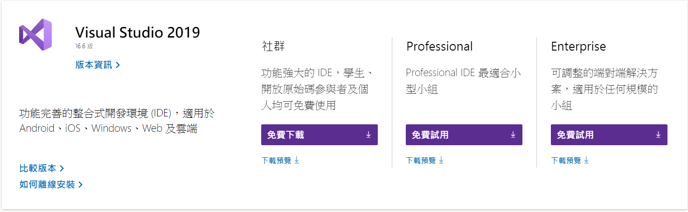

點第一個社群

再來會出現這個畫面

---
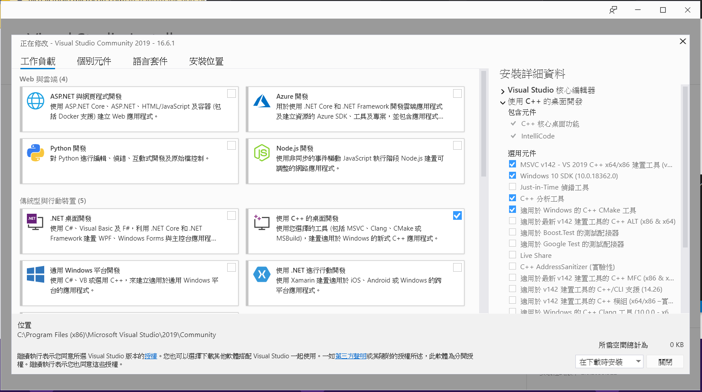
至少要勾選畫面中的那幾項才行。

---
如果之前就已經安裝過紫色的vs的話不需要再安裝一次，會直接跳以下畫面
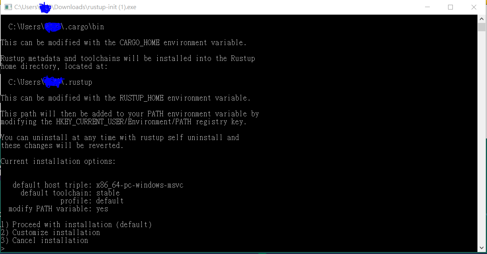
然後選第一個選項，直接打數字1然後
Enter就咯。

如果不行會出現這張圖
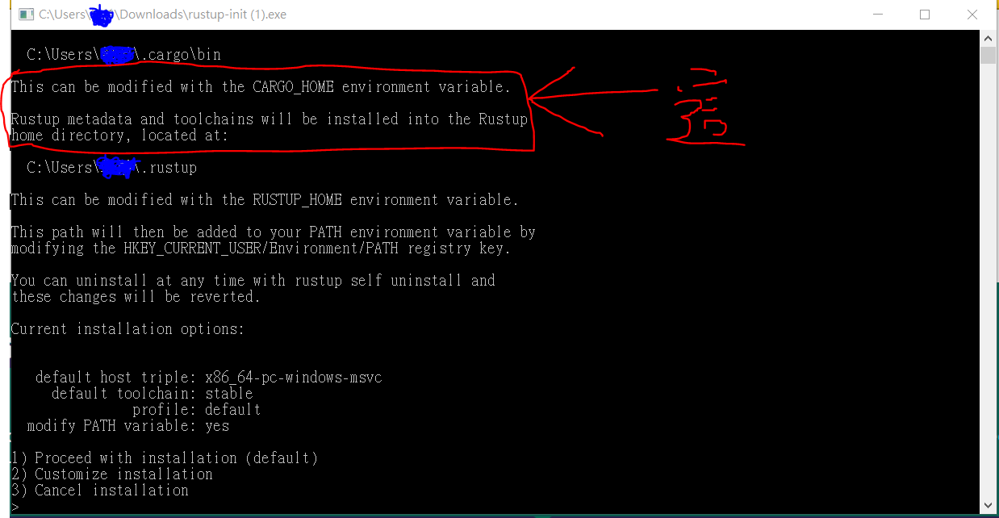
我圈起來的紅色區域會不太一樣，仔細看的話它告訴你，開發工具沒安裝、是否有安裝VS2015、VS2017等等，這裡指的VS是指紫色的VS不是藍色的。

---

## * 學習過程中的注意事項
再轉換到Cargo的注意事項，一定要在原本創建的目錄(如hello_world目錄)中，先創建src目錄，再把.rs檔移動到src目錄中，

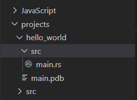

再移除編譯過的.exe檔;

在創建Cargo.toml檔中輸入的name一定要和專案的根目錄名稱相同，大小寫也要一樣，否則會出現以下這種情況
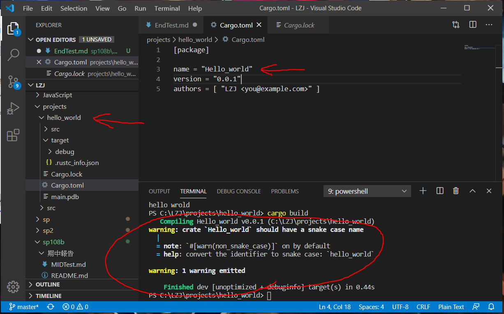

---
Cargo有一個我個人覺得算方便的地方，當你程式碼打完後要建置執行專案時，只要下一個指令Cargo就可以幫你處理到好，就不用在手動建置一個
.toml檔了

首先最起碼要有個專案目錄和程式碼像這樣。

PS.project只是存放專案目錄的目錄而已。

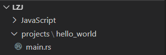

再來對圖片中的專案目錄開啟終端機，

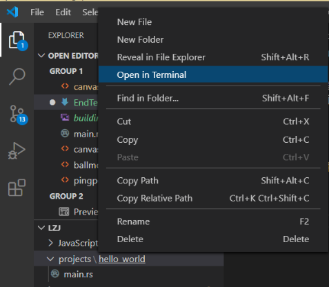

對著終端機輸入。

     cargo new 你的專案目錄名稱 --bin
PS.要完全一樣的名稱，不能專案名稱是小寫，但輸入指令的專案名稱是大寫。

像這樣

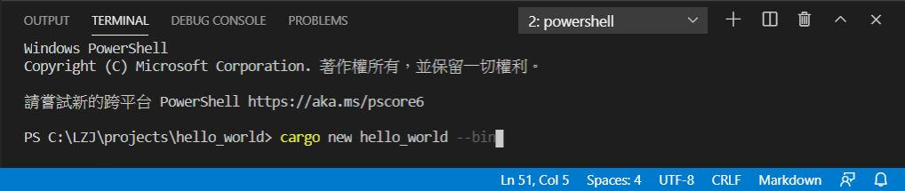

輸入完以後終端機會顯示一個訊息，告訴你建置了一個執行檔。

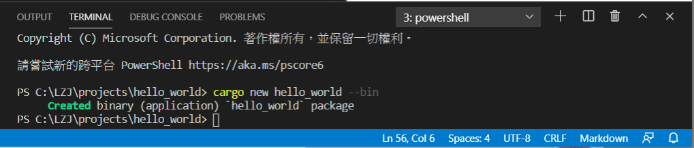

並且你的專案目錄會多一個跟你專案目錄同名的目錄

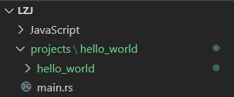

接著你就可以去執行它，也是先對著建置好的目錄開啟終端機，接著輸入。
           
    cargo run
輸入完以後終端機會告訴你，編譯hello_world，編譯完成花了多少時間，和執行編譯好的.exe檔，之後就會印出來結果。

如圖

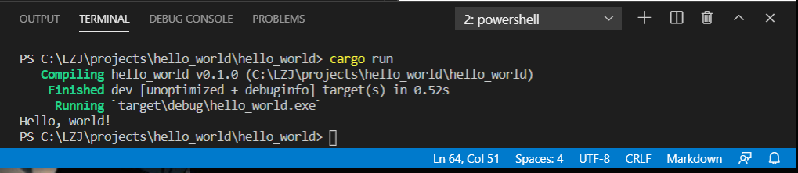

接著再去系統幫你建置好的目錄去找.toml檔，打開來看後原本以手動輸入的

    [package]

    name = "hello_world"
    version = "0.0.1"
    authors = [ "Your name <you@example.com>"
它都幫你建置好了。

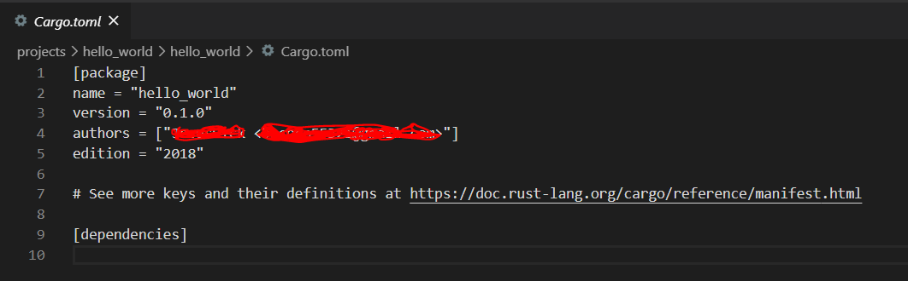

圖中name的地方仔細看的話，它就是你的專案目錄的名稱，因為你是用指令去建置執行檔的，所以可以避免掉名稱輸入錯誤的問題。

---
