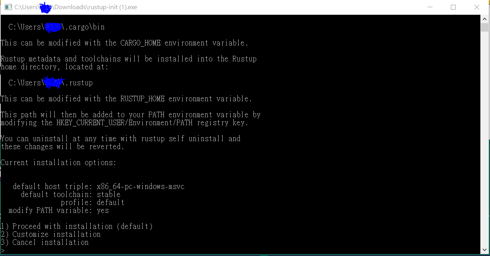
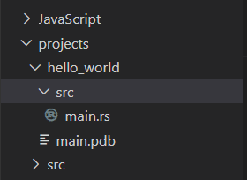
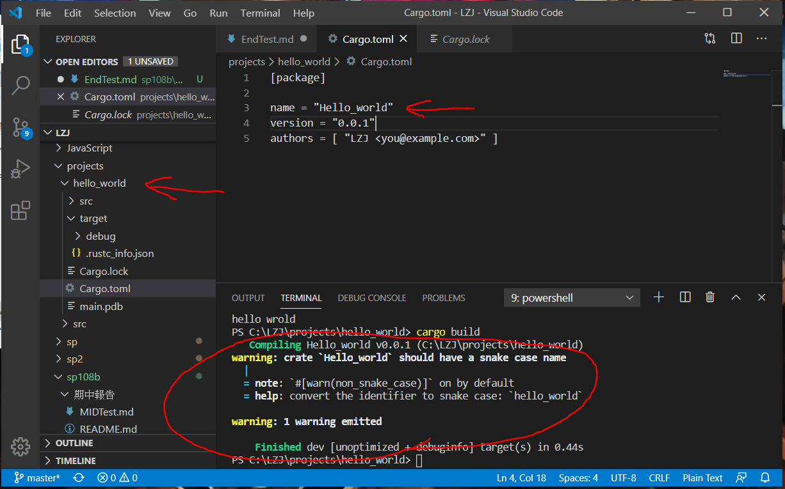
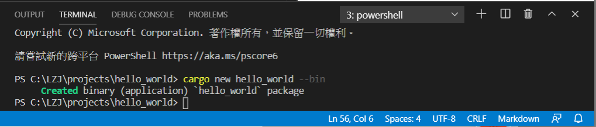
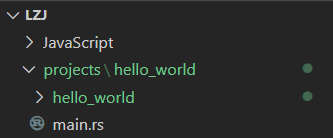
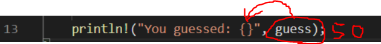
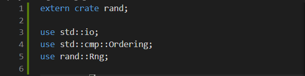

# 期末報告
## [學習rust語言](https://askeing.github.io/rust-book/)
在安裝Rust語言中我覺得它裡面有重要的資訊官網沒有說得很清楚。
---
* 前置作業:

請先下載

點第一個社群

再來會出現這個畫面

---

至少要勾選畫面中的那幾項才行。

---
如果之前就已經安裝過紫色的vs的話不需要再安裝一次，會直接跳以下畫面

然後選第一個選項，直接打數字1然後
Enter就可以了。

如果不行會出現這張圖

我圈起來的紅色區域會不太一樣，仔細看的話它告訴你，開發工具沒安裝、是否有安裝VS2015、VS2017等等，這裡指的VS是指紫色的VS不是藍色的。

---

## * 學習過程中的注意事項
再轉換到Cargo的注意事項，一定要在原本創建的目錄(如hello_world目錄)中，先創建src目錄，再把.rs檔移動到src目錄中，

再移除編譯過的.exe檔;

在創建Cargo.toml檔中輸入的name一定要和專案的根目錄名稱相同，大小寫也要一樣，否則會出現以下這種情況

---
Cargo有一個我個人覺得算方便的地方，當你程式碼打完後要建置執行專案時，只要下一個指令Cargo就可以幫你處理到好，就不用在手動建置一個
.toml檔了

首先最起碼要有個專案目錄和程式碼像這樣。

PS.project只是存放專案目錄的目錄而已。

再來對圖片中的專案目錄開啟終端機，

對著終端機輸入。

     cargo new 你的專案目錄名稱 --bin
PS.要完全一樣的名稱，不能專案名稱是小寫，但輸入指令的專案名稱是大寫。

像這樣

輸入完以後終端機會顯示一個訊息，告訴你建置了一個執行檔。

並且你的專案目錄會多一個跟你專案目錄同名的目錄

接著你就可以去執行它，也是先對著建置好的目錄開啟終端機，接著輸入。
           
    cargo run
輸入完以後終端機會告訴你，編譯hello_world，編譯完成花了多少時間，和執行編譯好的.exe檔，之後就會印出來結果。

如圖

接著再去系統幫你建置好的目錄去找.toml檔，打開來看後原本以手動輸入的

    [package]

    name = "hello_world"
    version = "0.0.1"
    authors = [ "Your name <you@example.com>"
它都幫你建置好了。

圖中name的地方仔細看的話，它就是你的專案目錄的名稱，因為你是用指令去建置執行檔的，所以可以避免掉名稱輸入錯誤的問題。

---

## 在學習猜數字中解讀，與注意事項

在第5行程式碼中的let其實就是C++或java中我們在的做變數宣告，
因前4行中的關係我們在hello_world中介紹過了。

如:

    int a = 3;  像這樣子的變數宣告。
但是在Rust中有一個要注意的地方，在用let宣告時它是預設為綁定變數，也就是說我在宣告

    let x=3;
x就都會是5不會變，如果我在底下使用x =  20,那x還是會是5,如果要使它可以變成x = 20可以使用mut，像以下輸出

    let mut x = 3;
    x = 20;

雖然執行出來可能會有錯誤訊息，但`x`的確被改成`10`了。

---
再來看到第8行程式碼的後段，

這可以把它理解為，我們把guess宣告成一個變數後，但是它終究只是一個值，但它們沒有其他空間放入參數進入guess這個值裡，所以

    String::new();
這段程式碼是在創造一個預留空間，給guess使用，而這預留空間裡的參數就代表guess。如下圖

接下來看到第10行和第11行程式碼，

先從第10段前面的程式碼看起

    io::stdin()
這段程式碼是使用我們在第1行中載入的關聯函式

後面的程式碼

    .read_line(&mut guess)
    ---
    在使用read_line時它只接受數值也就是let

若要讓它可以接受字串就必須將

    guess前面加入mut,像這樣(&mut guess)
---
接著看第11行的程式碼

    .expect("Failed to read line");
可以用來取得呼叫它的方法的結果值，如果呼叫它的結果不成功，
並顯示出傳給它的訊息，也就是"Failed to read line"。

---

最後看到第13行

其實這段就是印出我們輸入的值，而{}就是把guess輸入的值放進去，

所以印出的話有可能是

    You guessd: 50
---

### 在產生亂數階段的注意事項

因為在Cargo原函式庫中，並未加入產生亂數的套件，所以我們得自行加入外部套件，

    在[dependencies]下方加入rand="0.3.0"像這樣

    rand(套件名稱)="0.3.0"(版本)//也可以使用rand="*"，
    "*"米字號的意思是說，在rand的版本中找出適合的版本。

雖然有些人覺得這樣很麻煩，但這卻是它的優點，我用玩遊戲當作個比方
，當我們在玩遊戲時，破完關可能就刪掉遊戲了，不太可能再回去下載，但遊戲廠商為了解決在線玩家流量減少的問題時，便開發出了mode(模組)、套件和更改Skin(外觀)，為遊戲添加了更多可能性和多元性，讓玩家的遊玩品質和遊玩時間大幅提升，用這個比方去套用到rust上也是如此。

接著打

    Cargo build      //讓函式庫中的函式添加進來

添加進來的函示，可以到Cargo.lock的檔案中看到。

---

接著回到main.rs檔中添加程式碼照兩段程式碼

    extern crate rand; 
    //需要加這段程式碼是因為，
    rand本身不是cargo函式庫裡的函式，
    所以必須要用引用的方式使用它
    ---
    use rand::Rng; //在有效範圍中使用rand套件:如1~100

之後在第10行插入的程式碼可以解讀為

    let secret_number = rand::thread_rng().gen_range(-30, 101);
    //宣告一個變數，變數的值等於用rand產生的亂數透過重1到101中挑選一個。

---

先將13到20行加入到loop迴圈中

        loop {
        println!("Please input your guess.");

        let mut guess = String::new();

        io::stdin().read_line(&mut guess)
            .expect("failed to read line");

        println!("You guessed: {}", guess);

    }  //loop是一個無限迴圈，除非設定條件跳出，否則會一直重複。

之後在第19行插入程式碼

    let guess: u32 = match guess.trim().parse() {
            Ok(num) => num,
            Err(_) => continue,
        };
`let guess: u32`意思是讓guess的型別是無號數，若要讓範圍延伸到有負數的話只要，將`u32`改成`i32`就可以了。

`match guess.trim().parse()`意思是匹配guess變數，並先修剪掉其他符號如:`\n`,`%d`等等，再做解析的動作。

接下來是`{ Ok(num) => num, Err(_) => continue,};`
這段程式碼是將解析出來的值去做判斷，是數字就去到下一步，不是則重頭開始(continue).

最後在第26行插入程式碼

    match guess.cmp(&secret_number) {
    Ordering::Less    => println!("Too small!"),
    Ordering::Greater => println!("Too big!"),
    Ordering::Equal   => {
        println!("You win!");
        break;
        }
    }  //這段程式碼是讓產生出來的亂數，跟我們輸入的亂數去做比較

以下說明

`Ordering::Less    => println!("Too small!")`比較猜的數字，若小於亂數，就印出`"Too small!"`

`Ordering::Greater => println!("Too big!")`比較猜的數字，若大於亂數，就印出`"Too big!"`

`Ordering::Equal   => {println!("You win!");    break; }}`
這段程式碼的意思是跟前面相同，只是多了個`break`，還記得前面我們有加`loop`嗎?這裡的`break`就是為了猜對數字之後，要跳出`loop`的條件，若沒有這個`break`即便猜對數字了，也會一直重複。

以下猜數字的程式碼 修改自[Rust程式語言](https://askeing.github.io/rust-book/guessing-game.html)
範圍可到負數。

